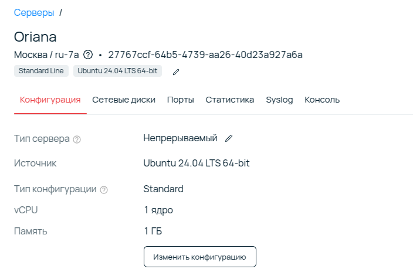
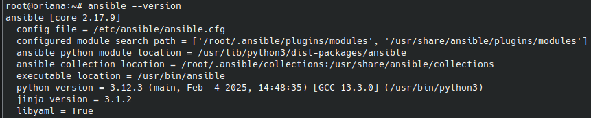
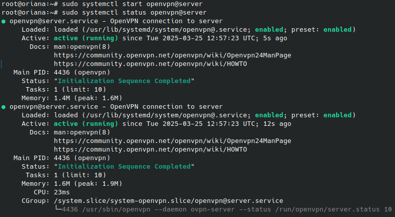
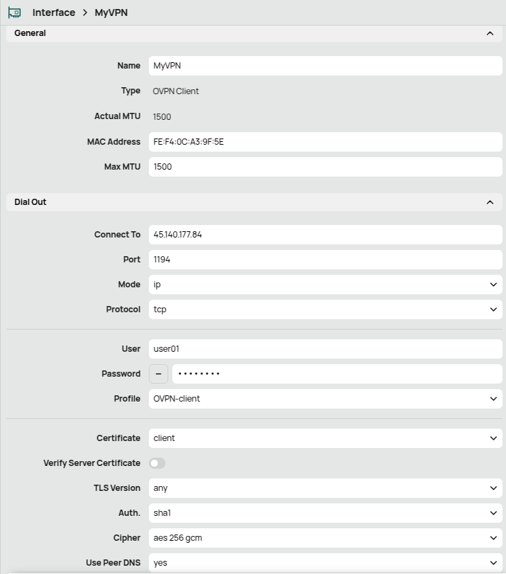
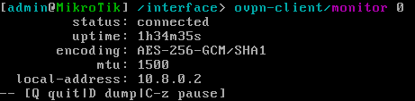
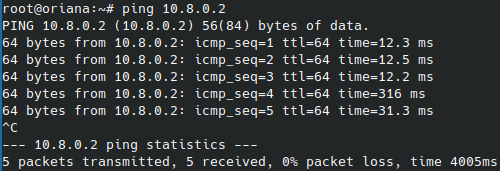
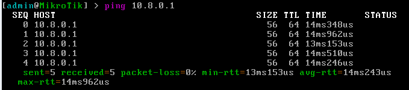

University: [ITMO University](https://itmo.ru/ru/)

Faculty: [FICT](https://fict.itmo.ru)

Course: [Network programming](https://github.com/itmo-ict-faculty/network-programming)

Year: 2024/2025

Group: K3321

Author: Sadovaya Anastasia Romanovna

Date of create: 25.03.2025

Date of finished: 25.03.2025

# Лабораторная работ №1 "Лабораторная работа №1 "Установка CHR и Ansible, настройка VPN""

## Цель:
Целью данной работы является развертывание виртуальной машины на базе платформы Selectel с установленной системой контроля конфигураций Ansible и установка CHR в VirtualBox

## Ход работы:

1. Для выполнения работы был приобретен сервер на базе платформы Selectel с конфигурацией: 1 CPU, 32 ГБ SSD-диск, публичный ip-адрес:



2. Далее на сервере была установлена Ansible:



3. И настроен OpenVPN сервер(```sudo apt install -y openvpn openvpn-systemd-resolved easy-rsa```) со следующей конфигурацией:

```
port 1194

proto tcp
proto tcp6

dev tun

ca /etc/openvpn/easy-rsa/pki/ca.crt
cert /etc/openvpn/easy-rsa/pki/issued/openvpn.networklab.com.crt
key /etc/openvpn/easy-rsa/pki/private/openvpn.networklab.com.key

dh /etc/openvpn/easy-rsa/pki/dh.pem

topology subnet

server 10.8.0.0 255.255.255.0
server-ipv6 2001:db8:0:123::/64

ifconfig-pool-persist /var/log/openvpn/ipp.txt

push "redirect-gateway def1 bypass-dhcp"
push "route-ipv6 2000::/3"

client-to-client

keepalive 10 120

persist-key
persist-tun

status /var/log/openvpn/openvpn-status.log

verb 3

explicit-exit-notify 1
```

4. Запускаем сервер:



5. Далее необходиом настроить openvpn-client для MicroTik в VirtualBox на локальной машине(предварительно перенеся файлы(ca.crt, user01.crt, user01.key) с помощью scp с сервера на виртуалку и импортировать их через /certificate import):



Была полученя следующая схема взаимодействия устройств:


Подключение к OpenVPN в MicroTik:



Пинги внутри туннеля между клиентом и сервером:

SERVER --> CLIENT


CLIENT --> SERVER



## Вывод:

В результате выполнения лабораторной работы были освоены методы по настройке CHR с OpenVPN клиентом на VirtualBox и OpenVPN сервера на VPS Selectel.