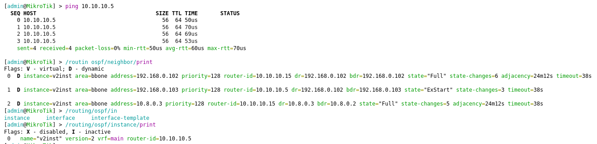

University: [ITMO University](https://itmo.ru/ru/)

Faculty: [FICT](https://fict.itmo.ru)

Course: [Network programming](https://github.com/itmo-ict-faculty/network-programming)

Year: 2024/2025

Group: K3321

Author: Sadovaya Anastasia Romanovna

Date of create: 28.03.2025

Date of finished: 16.04.2025

# Лабораторная работ №2 "Развертывание дополнительного CHR, первый сценарий Ansible"

## Цель:
С помощью Ansible настроить несколько сетевых устройств и собрать информацию о них. Правильно собрать файл Inventory.

## Ход работы:

1. Был настроен OpenVPN сервер с белым IP удаленно на базе Selectel, 2 CHR локально в виртуальных машинах. Проверка доступности виртуальных машин с сервера


2. Далее был сгенерирован и перенесен на клиенты ssh-сертификат с помощью scp:

```scp ~/.ssh/id_rsa.pub admin@xx.xx.xx.xx:/key.pub```

3. Был написан файл hosts.ini, описывающий подключение к клиентам:

```
[routers]
router1 ansible_host=10.8.0.2 router_id=10.10.10.5
router2 ansible_host=10.8.0.3 router_id=10.10.10.15

[routers:vars]
ansible_connection=ansible.netcommon.network_cli
ansible_network_os=community.routeros.routeros
ansible_user=admin
```

4. Написаны PlayBook(отдельно для переноса конфигурации микротиков и отдельно для всего остального)


5. Запускаем сценарии ansible(```ansible-playbook -i hosts.ini main.yml```):


6. Проверка локальной связанности и конфигурации на микротиках:

Роутер 1 10.10.10.5(10.8.0.2)


Роутер 2 10.10.10.15(10.8.0.3)



7. Получение конфигурации с роутеров:


[Конфигурация 1](./router1_configuration.json)

[Конфигурация 2](./router2_configuration.json)


## Вывод:

В результате выполнения лабораторной работы были освоены методы по работе и настройке Ansible