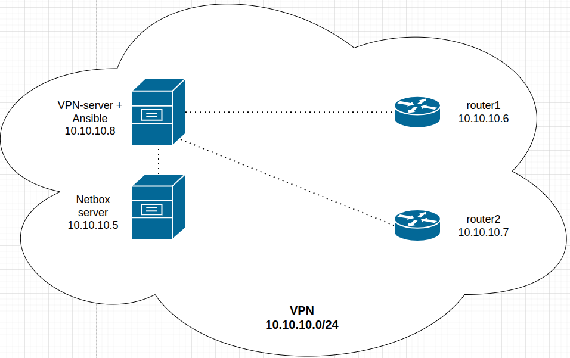
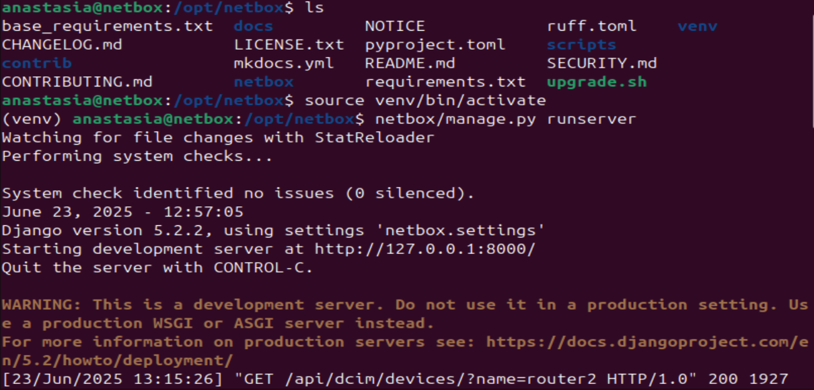
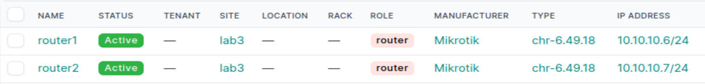
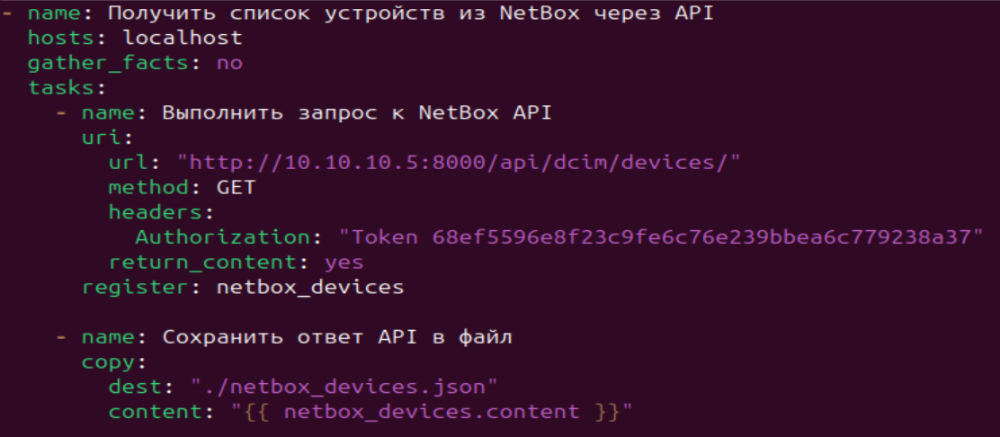
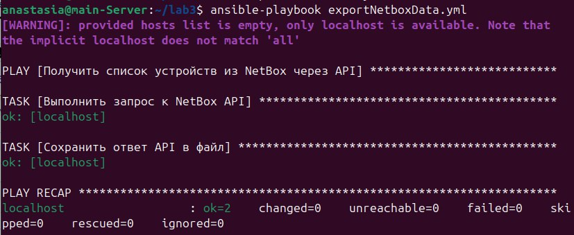
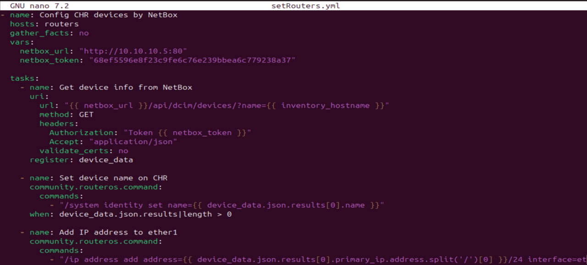
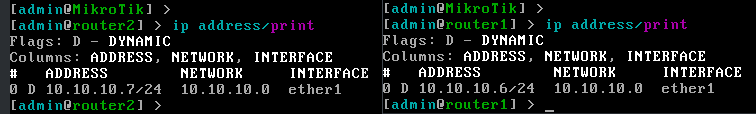
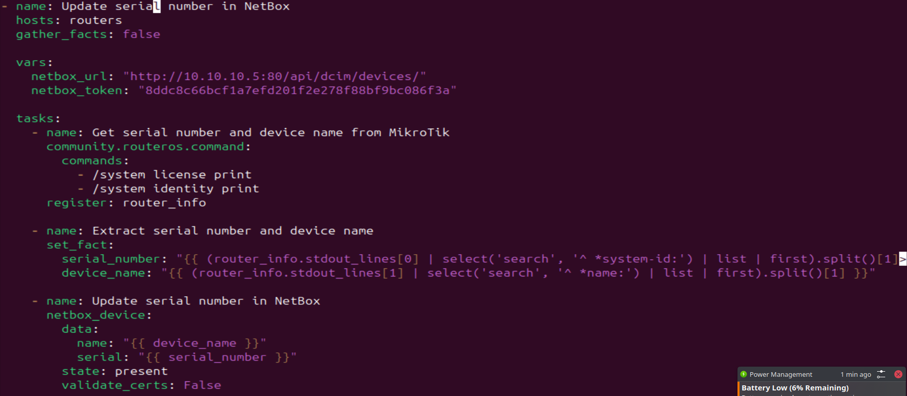
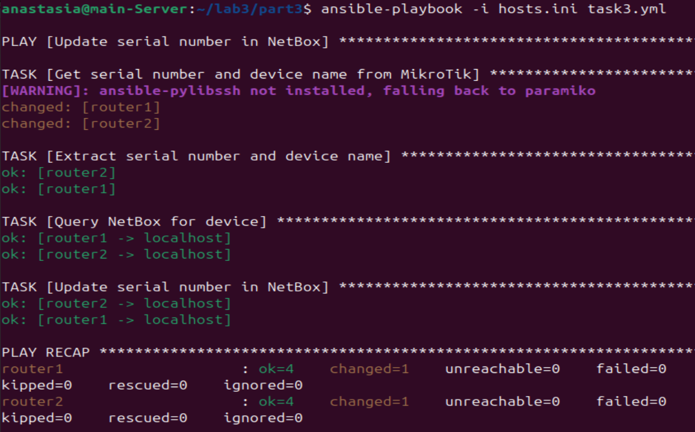
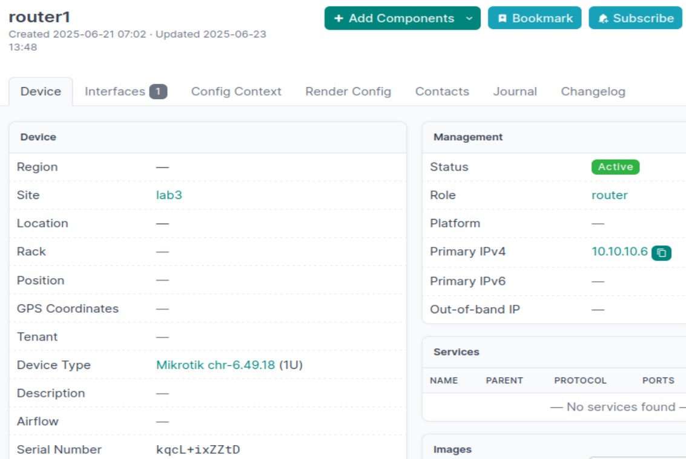

University: [ITMO University](https://itmo.ru/ru/)

Faculty: [FICT](https://fict.itmo.ru)

Course: [Network programming](https://github.com/itmo-ict-faculty/network-programming)

Year: 2024/2025

Group: K3321

Author: Sadovaya Anastasia Romanovna

Date of create: 12.06.2025

Date of finished: 23.06.2025

# Лабораторная работ №3 "Развертывание Netbox, сеть связи как источник правды в системе технического учета Netbox"

## Цель:
С помощью Ansible и Netbox собрать всю возможную информацию об устройствах и сохранить их в отдельном файле.

## Ход работы:

1. 2 сервера и 2 chr-клиента объединены в одну сеть посредством vpn:



2. На одном из серверов был настроен NetBox(склонирован репозиторий и запущен скрипт upgrade.sh)



3. Была занесена вся информация о CHR в Netbox.



4. Был написан файл hosts.ini, описывающий подключение к клиентам:

```
[routers]
router1 ansible_host=10.10.10.6
router2 ansible_host=10.10.10.7

[routers:vars]
ansible_connection=ansible.netcommon.network_cli
ansible_network_os=community.routeros.routeros
ansible_user=admin
```

5. Написаны PlayBook-и для Ansible в соответствии с заданиями:

 - Сохранить все данные из Netbox в файл [netbox_devices.json](./netbox_devices.json)





- Изменить названия устройств, добавить IP адреса на устройства(на скрине с результатом видно, что изменились названия устройств)





- Собрать и внести серийные номера устройств в Netbox








## Вывод:

В результате выполнения лабораторной работы были освоены методы по работе c Netbox и его интеграция с Ansible