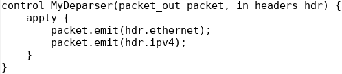

University: [ITMO University](https://itmo.ru/ru/)

Faculty: [FICT](https://fict.itmo.ru)

Course: [Network programming](https://github.com/itmo-ict-faculty/network-programming)

Year: 2024/2025

Group: K3321

Author: Sadovaya Anastasia Romanovna

Date of create: 23.06.2025

Date of finished: 24.06.2025

# Лабораторная работ №4 "Базовая 'коммутация' и туннелирование используя язык программирования P4"

## Цель:
Изучить синтаксис языка программирования P4 и выполнить 2 задания обучающих задания от Open network foundation для ознакомления на практике с P4.

## Ход работы:

1. Для выполнения работы был установлен vagrant и запущена виртуальная машина ubuntu-20.04 с предустановленным ПО для работы с p4:


2. Далее необходимо было выполнить задания из репозитория:

* Implementing Basic Forwarding:

Нужно было модифицировать файл [basic.p4](./basic.p4):

- Добавлена логика извлечения заголовков(MyParser)


- Реализована логика пересылки пакета(ipv4_forward)


- Добавлена валидация заголовка в MyIngress


- Реализована логика последовательной сборки пакета(MyDeparser)




Для проверки корректности кода с помощью ```make run``` была запущена среда исполнения, внутри которой проверена работоспособность нашей написанной логики коммутации, посредством пинг-ов между устройствами:


* Implementing Basic Tunneling:

Нужно было модифицировать файл [basic_tunnel.p4](./basic_tunnel.p4):

- Извлечение myTunnel при etherType == 0x1212:


- Установка egress порта


- Добавлена таблица myTunnel_exact, вызывающая myTunnel_forward или drop


- Депарсер эмитит Ethernet, затем myTunnel, затем IPv4


Для проверки корректности кода с помощью ```make run``` была запущена среда исполнения, внутри которой проверена работоспособность нашей написанной логики туннелирования(```xterm h1 h2```):


## Вывод:

В результате выполнения лабораторной работы были освоены методы по работе c vagrant и языком P4 для сетевых устройств.